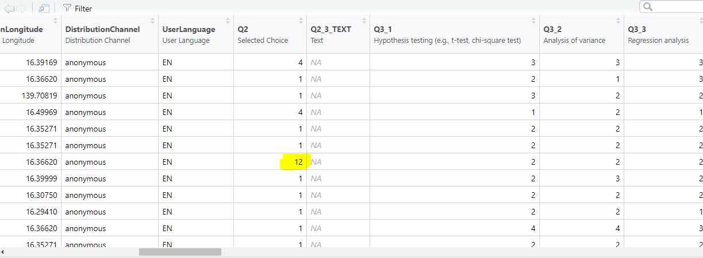
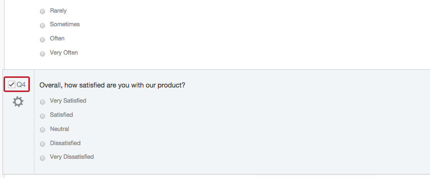

# FAQ

Here we will post the most frequent issues you might face with handling Qualtrics data in R.

## Multiple answers stored in one cell in CSV

*Issue:* When exported from Qualtrics to CSV, answers on multiple choice questions with multiple answers are stored in one cell. In the picture below you can see that this issue appears in the column "Q2", where a respondent chose two answers ("1" and "2"), and these two answers are merged together in one cell.

```{r, echo=F, fig.align='center',out.width='72%'}

```


*Solution:*

First, when you go to export your data from Qualtrics ("Data & Analysis" > "Export & Import" > "Export data") choose CSV, and in the bottom-right corner you will find "More options". After you click it, scroll down a bit, and there you should tick "Split multi-value fields into columns". Please make sure that you are using the correct settings in qualtrics export as depicted below:

```{r, echo=F, fig.align='center',out.width='40%'}
knitr::include_graphics('qualtrics_export.png')
```

So, make sure you tick:

* Use numeric values
* Remove line breaks
* Split multi-value fields into columns

This should result in your multi-value fields being divided into columns as depicted below.

```{r, echo=F, fig.align='center',out.width='72%'}
knitr::include_graphics('separate.png')
```


## Labels for numeric values in CSV output 

**Issue**: When exported from Qualtrics to CSV, answers are coded as numeric values, and I don't know which value corresponds to which label(=answer)?

**Solution:**

You can check it or even change it in Qualtrics by doing the following steps:

1. Navigate to the Survey tab and select the question you want to check labels for.

```{r, echo=F, fig.align='center',out.width='72%'}

```

2. Click the gray gear to the left to access the Question Options and choose Recode Values.

```{r, echo=F, fig.align='center',out.width='72%'}
knitr::include_graphics('recode2.png')
```

There you can see how Qualtrics coded your responses and you can potentially change it.

```{r, echo=F, fig.align='center',out.width='72%'}
knitr::include_graphics('recode3.png')
```


## Bar chart for multiple choice question with multiple answers

**Issue:** How to create a bar chart for multiple answers on multiple choice questions?


**Solution:**

Let's load the packages `qualtRics` and `ggplot2` and Qualtrics survey data first:

```{r,warning=FALSE, message=FALSE}
library(qualtRics)
library(ggplot2)
qualtrics_1 <- read_survey("mrda_2.csv")
```

We would like to visualize question 2 (multiple choice question with multiple answers) which has 4 categories:

```{r}
qualtrics_1[,c("Q2_1","Q2_2","Q2_3","Q2_4")]
```

We see that we have some NA values that needs to be handeled. Therefore, we replace NA values with 0 for each category:

```{r}
qualtrics_1$Q2_1 <- ifelse(is.na(qualtrics_1$Q2_1),0,qualtrics_1$Q2_1)
qualtrics_1$Q2_2 <- ifelse(is.na(qualtrics_1$Q2_2),0,qualtrics_1$Q2_2)
qualtrics_1$Q2_3 <- ifelse(is.na(qualtrics_1$Q2_3),0,qualtrics_1$Q2_3)
qualtrics_1$Q2_4 <- ifelse(is.na(qualtrics_1$Q2_4),0,qualtrics_1$Q2_4)
```

Third, we compute share for each category:

```{r}
share_1 <- sum(qualtrics_1$Q2_1)/nrow(qualtrics_1)
share_2 <- sum(qualtrics_1$Q2_2)/nrow(qualtrics_1)
share_3 <- sum(qualtrics_1$Q2_3)/nrow(qualtrics_1)
share_4 <- sum(qualtrics_1$Q2_4)/nrow(qualtrics_1)
```

Finally, we add category shares to the rest of the data:

```{r}
shares <- data.frame(share = rbind(share_1,share_2,share_3,share_4),response=c("yes, at uni", "yes, at job", "yes, other", "no"))
head(shares)
```

::: {.infobox_red .caution data-latex="{caution}"}

If you are not sure which numeric value refers to which label, you can find how to do it under question **"Labels for numeric values in CSV output"**.
:::

Now we are set to produce a bar chart. Please note two important points:

* We use `reorder()` function to wrap around the variable on x-axis in aesthetics part of ggplot function. In this way our bar chart will be shown in descending order.

* We use `coord_flip()` function to turn our bar chart from being vertical to horizontal position. 

```{r}
ggplot(shares, aes(x =reorder(response,share), y = share)) + 
  geom_col(aes(fill = response)) + 
  labs(x = "", y = "", title = "Share of responses") + 
  geom_text(aes(label = sprintf("%.0f%%", share/sum(share) * 100)), hjust = -0.2, size=6) + 
  theme_minimal() + ylim(0,0.8) + scale_fill_brewer(palette = "Blues") + 
  theme(axis.text.x = element_text(size=16), 
        axis.text.y = element_text(size=16), 
        plot.title = element_text(hjust = 0.5, color = "#666666"), 
        legend.position = "none", title = element_text(size=20)) + 
  coord_flip()
```

In the end, to save generated plot, we can use `ggsave()` function. The plot will be saved in your working directory.

```{r}
ggsave("bar_chart.jpg", height = 5, width = 8.5)  
```


